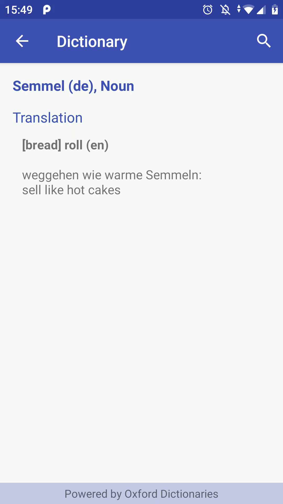

# vocabtrainer
Capstone Project Udacity Nanodegree

Simple Vocab trainer, that uses the Oxford Dictionary API to look up additional words.
You can add words, or train with some existing.
Words can be added manually, or scanned using Google's vision API.

## Features ##

### Vocab Training ###
* train collected words
* get details from the dictionary

### Search for words in the Oxford Dictionary ###

### Add words ###
* enter words directly
* or scan words using the Google's vision API

